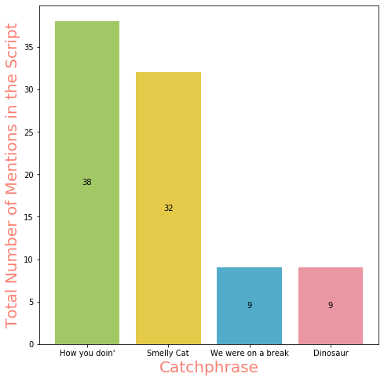
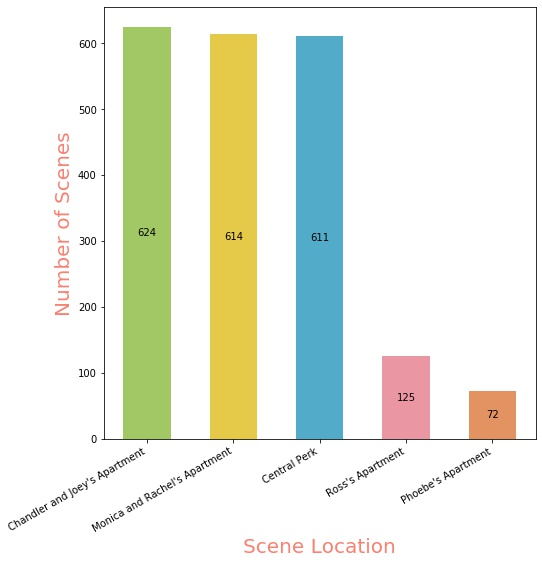

# FRIENDS-TV-show-Dialogues-and-Scenes-Analysis

Scraped FRIENDS dialogues from: https://fangj.github.io/friends/ using BeautifulSoup4

And performed analysis on dialogues and scenes. Performed sentiment analysis on the basis of dialogues.

Catchphrase Frequency:

Location Summary:

Characters' Emotion Quotient Correlation:

Sentiment Analysis:

